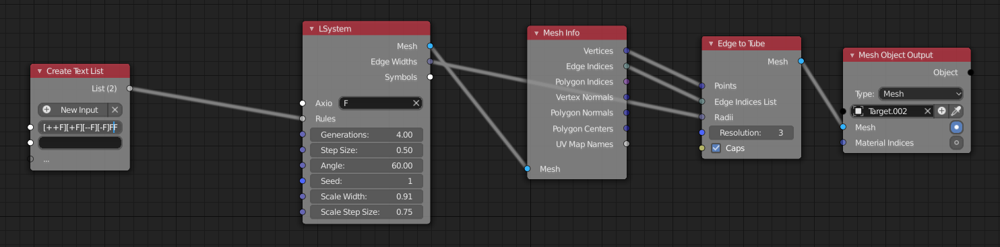

# Fractal snowflakes
Snowflake models using LSystem node in Blenders Animation nodes editor.

## Used algorithms
With each snowflake I used the LSystem node. In text list node made new rule using IFS (iterated function systems) Koch curve rules for repetive expresion. This expresion was then repeated by the LSystem in N generations resulting in one part of the showflake.

In Koch curve rules F means forward line, + means rotate line in positive direction and - in the negative direction.

Next I made triangular tube mesh from the mesh info produced by LSystem node and repeated the pattern of the snowflake 6 times to produce a model of the snowflake.

Lastly added some Planes to make a box around the snowflake and created glowing material.

## Snowflake n.1

## Snowflake n.2

## Snowflake n.3

## Snowflake n.4

